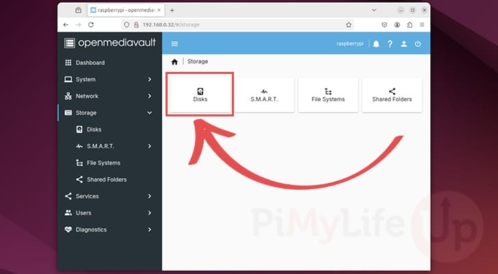

Based on information from article:
<https://pimylifeup.com/raspberry-pi-openmediavault/>

Over the next few sections, we will be walking you through the steps to
installing and configuring OpenMediaVault on your Raspberry Pi. You will
quickly see how this software is a great way to set up a NAS on your
Raspberry Pi.

For this section, we are assuming that you are using the lite version of
Raspberry Pi OS as your operating system. However, this should function
fine on any Debian based operating system.

Please note that you need to avoid using a desktop variant of your
chosen operating system. OpenMediaVault will only work on terminal-based
systems. In the case of the Pi, this is [Raspberry Pi OS
Lite](https://pimylifeup.com/download-raspbian/).

Installing OpenMediaVault to a Raspberry Pi {#installing-openmediavault-to-a-raspberry-pi .ListParagraph}
===========================================

**1.** Before we install OpenMediaVault, let's update the existing
packages by running the following two commands.

The first command will update the package list cache, and the second
will upgrade any out-of-date packages.

sudo apt update

sudo apt upgrade

**2.** Before we install OpenMediaVault we must first run their
pre-install script. This script will set up your ethernet connection to
be persistent. This will help solve potential connectivity issues later.

You can run this script by running the following command within the
terminal.

wget -O -
https://raw.githubusercontent.com/OpenMediaVault-Plugin-Developers/installScript/master/preinstall
\| sudo bash

**3.** Once the script finishes running, you must restart your Raspberry
Pi by running the following command.

sudo reboot

**4.** Now we can run the following command to download the
OpenMediaVault install script and pipe it directly through to bash.

This script will install and set up everything needed to run
OpenMediaVault on the Raspberry Pi.

You can verify the contents of this script by going directly to the
OpenMediaVault Plugin developers [install script
repository](https://github.com/OpenMediaVault-Plugin-Developers/installScript).

wget -O -
https://raw.githubusercontent.com/OpenMediaVault-Plugin-Developers/installScript/master/install
\| sudo bash

Please note that this process can take some time as the script needs to
install numerous packages that the OpenMediaVault software requires.

**5.** Once the installation process has completed your Raspberry Pi
should be automatically restarted by the script.

If for some reason your Pi wasn't restarted automatically, you can
restart it by using the following command within the terminal.!

sudo reboot

First Time Loading OpenMediaVault on the Raspberry Pi
=====================================================

**6.** In this section, we will be showing you how to access the web
interface for the OpenMediaVault software running on your Raspberry Pi.

To be able to access the OpenMediaVault Web GUI, you will need to know
your Raspberry Pi's IP address.If you don't know your [Raspberry Pi's IP
address](https://pimylifeup.com/raspberry-pi-ip-address/), you can run
the following command.

hostname -I

**7.** With your Raspberry Pi's local IP address, go to the following
address in your favorite web browser.

Ensure that you replace "\<IPADDRESS\>" with the IP you got in the
previous step.

http://**\<IPADDRESS\>**

**8.** Upon loading the OpenMediaVault web interface, you will be asked
to log in to be able to proceed.

The default **username** is admin, and the
default **password** is openmediavault.

{width="6.5in"
height="3.571527777777778in"}

**9.** Once you have logged in, you will be greeted by the
OpenMediaVault dashboard. While this dashboard may be blank at the
moment, we will be showing you how to add additional elements to the
dashboard.

{width="6.5in"
height="3.571527777777778in"}

Changing the Default OpenMediaVault Password
============================================

**10.** One of the first things you should do is change the password for
your OpenMediaVault admin account. Leaving it as the default will allow
anyone to gain access quickly.

To change the password, you need to click the person icon in the
top-right corner (**1.**).

In the menu that appears, you will want to click the option labeled
"Change Password" (**2.**).

{width="6.5in"
height="3.571527777777778in"}

**11.** On this page, fill out the new password that you will use to
access the OpenMediaVault admin user (**1.**).

Once done, click the "**Save**" button (**2.**) to save the new
password.

{width="6.5in"
height="3.571527777777778in"}

Configuring the Dashboard for your OpenMediaVault Installation
==============================================================

**12.** By default, the OpenMediaVault dashboard is completely blank.
You will need to enable each widget you want to see before the dashboard
will begin to show anything.

To change the settings for your dashboard, start by clicking the person
icon in the top-right corner (**1.**).

From the menu that appears, you will want to click the option labeled
"Dashbaord" (**2.**).

{width="6.5in"
height="3.571527777777778in"}

**13.** This next screen will give you a list of all the various widgets
that the OMV dashboard supports (**1.**). These can be quite useful for
quickly checking the status of both OpenMediaVault and your Raspberry
Pi.

Once you have ticked all the boxes next to the widgets you want
displayed, click the "Save" button (**2.**).

{width="6.5in"
height="3.571527777777778in"}

**14.** Returning back to the dashboard you should now see a lot more
information being displayed. Below you can see what ours looked like
after enabling a fair amount of the widgets.

{width="6.5in" height="3.571527777777778in"}

Adding your First Drive to your Raspberry Pi OpenMediaVault NAS
===============================================================

**15.** Due to the way OpenMediaVault works on the Raspberry Pi, you
will need to manually add each drive that you want to be a part of your
NAS. You will then add shared folders to these mounted filesystems
later.

To give you an example of how this all works, we will be using a 128GB
portable drive that we have plugged in to our Raspberry Pi. If you are
using a brand-new drive, you don't have to worry about formatting it
either as OpenMediaVault allows us to do that through its web interface.

You can begin to add and configure your first drive by clicking the
"Storage" option in the sidebar.

{width="6.5in"
height="3.571527777777778in"}

**16.** Now that we are within the storage options page, let us start by
verifying that OpenMediaVault can see our attached disks.

To do this, click the "Disks" option as shown below.

{width="6.5in"
height="3.571527777777778in"}

**17.** On this screen, you will see each of the attached drives that
the software can detect (**1.**).

If any of your drives need formatting, select it and then click the
little eraser icon (**2.**) and follow the prompts. This will take the
drive back to a state that OpenMediaVault expects it to be in.

Once you are happy with the disks you have attached, change to the "File
Systems" (**3.**) screen using the sidebar.

{width="6.5in"
height="3.571527777777778in"}

**18.** Now that you are on the file systems page, there are two
different ways you can attach this drive to OpenMediaVault.

If you already have a filesystem set up on your drive, simply click the
play button (**3.**) and **skip to step 21**. Typically, it is easier to
start fresh with a drive that you are adding to your Raspberry Pi NAS.

Otherwise, if you need to add a filesystem to the drive, click the plus
button symbol (**1.**).

Upon clicking this button, you will be given a list of filesystems you
can use to format your drive (**2.**). For the Raspberry Pi we recommend
using EXT4 due to the lower performance requirements.

{width="6.5in" height="3.571527777777778in"}

**19.** On this next page, you will be asked to select the device on
which OpenMediaVault should create this new filesystem (1.).

Select the drive that you want to write to and click the "Save" button
(**2.**).

{width="6.5in"
height="3.571527777777778in"}

**20.** OpenMediaVault on your Raspberry Pi will now begin to reformat
the selected drive using your chosen file format.

Once the process has completed, click the "Close" button.

{width="6.5in"
height="3.571527777777778in"}

**21.** Once a filesystem has been setup, or if you have already created
one previously you will now want to mount the drive to your Raspberry Pi
OpenMediaVault NAS.

To do this, click the "File System" select box and then find and click
your filesystem (**1.**).

With the filesystem selected, you will want to click the "Save" button
(**2.**).

{width="6.5in" height="3.571527777777778in"}

**22.** Before this filesystem is mounted to your Raspberry Pi, you will
need to confirm the pending changes. Begin this process by clicking the
tick icon in the top-right corner.

{width="6.5in"
height="3.571527777777778in"}

**23.** To confirm the addition of this new drive, click the "Yes"
button again.

{width="6.5in"
height="3.571527777777778in"}

Creating the Shared Folder
==========================

**24.** Our next step is to create an OpenMediaVault shared folder on to
our newly mounted filesystem. To begin the process of creating this
shared folder, click the "Shared Folders" option (**1.**).

Next, click the plus symbol button at the top of the list (**2.**).

{width="6.5in"
height="3.571527777777778in"}

**25.** Using this form, you will be asked to fill out the information
for your shared folder. There are a few different fields you need to set
within this dialog.

1.  First is the name of the share that you want to set (**1.**). This
    will automatically be set as the name of the folder as well.

2.  The second field is the filesystem that you want this folder created
    on (**2.**). In our case, we have only created a single filesystem
    so there is only one option for us.

3.  The third field is the path to the shared folder (**3.**). This will
    automatically be set to the same name as the shared folder. However,
    you can change this to a different location if you would like.

4.  The fourth and final relevant field is the "**Permissions**" field
    (**4.**). Use this field to set the permissions you want to be
    applied to the folder, such as which user group should be able to
    read and write to the folder.

Once you have filled out all the fields, click the "**Save**" button
(**5.**) at the bottom of the screen.

{width="6.5in"
height="3.571527777777778in"}

**26.** Before OpenMediaVault will create this new folder you will need
to confirm the pending change.

To do this, click the tick icon in the top right corner of the yellow
pop-up message.

{width="6.5in"
height="3.571527777777778in"}

**27.** You will be asked if you really want to apply the new
changes, click the "Yes" button to create the shared folder.

{width="6.5in"
height="3.571527777777778in"}

Enabling SAMBA/CIFS within OpenMediaVault
=========================================

**28.** Due to the way OpenMediaVault works, your shared folders won't
actually be "shared" until you enable a protocol such as SMB. On top of
this, each shared folder then must be individually enabled for that
protocol.

Over these next few steps, we will show you how you can enable SMB in
OpenMediaVault and share a folder.

To begin enabling this functionality you will want to
first click "Services" in the sidebar (**1.**).

Next, you will want to select the option labeled "SMB/CIFS" (**2.**).

{width="6.5in"
height="3.571527777777778in"}

**29.** You will now be greeted by two options, "Settings" and "Shares".

Before we can begin adding shares to SMB, we will need to enable SMB on
OpenMediaVault by selecting the "Settings" option.

{width="6.5in"
height="3.571527777777778in"}

**30.** Within this page, click the "**Enable**" toggle (**1.**). This
toggle will switch on support for SMB/CIFS on your Raspberry Pi.

Once enabled, click the "**Save**" button (**2.**) to continue.

{width="6.5in" height="3.571527777777778in"}

**31.** Before SMB is enabled you will need to confirm these pending
changes by clicking the tick icon.

{width="6.5in"
height="3.571527777777778in"}

**32.** Next, click the "Yes" button to enable SMB shared drives on your
OpenMediaVault installation on your Raspberry Pi.

{width="6.5in"
height="3.571527777777778in"}

Adding a Shared Folder to SMB on OpenMediaVault
===============================================

**33.** With SMB/CIFS now enabled on our Raspberry Pi, we need to add an
actual share. Your shared folders won't automatically be shared over the
various services that OpenMediaVault supports.

To add an SMB share, you will need to click the "**Shares**" option in
the sidebar (**1.**).

Within this screen, click the "+" button (**2.**).

{width="6.5in"
height="3.571527777777778in"}

**34.** Within the "**Add Share**" dialog, there is a couple of things
you will need to take into consideration.

1.  The first thing you need to do is select the "**Shared folder**"
    (**1.**). This option will show you a list of the shared folders you
    have created. You should have a shared folder from earlier in this
    guide.

2.  The next important option here is the "**Public**" option (**2.**).
    Using this option, you can dictate whether non-authenticated users
    can access the share (Guests).

3.  Finally, the other option you may use is the "**Read only**" option
    (**3.**). By making use of this option, you can set it so that users
    are only able to read the contents of the shared folder and not
    modify them.

Once you have configured everything to fit your needs, click the
"**Save**" button (**4.**).

{width="6.5in"
height="3.571527777777778in"}

**35.** Like with any other change in OpenMediaVault you will need to
confirm the addition of this shared folder by clicking the arrow icon.

{width="6.5in"
height="3.571527777777778in"}

**36.** Finally, confirm the addition of this share by clicking the
"Yes" button.

{width="6.5in"
height="3.571527777777778in"}

**37.** You should now see your first folder being shared through your
Raspberry Pi OpenMediaVault installation.

You can now continue to add as many shared folders as you like to help
grow out your Raspberry Pi NAS.

{width="6.5in"
height="3.571527777777778in"}

Adding New Users to OpenMediaVault on your Raspberry Pi
=======================================================

**38.** In this section, we are going to quickly run you through the
process of adding new users within the OpenMediaVault web interface. You
will be able to use these users to access the shared folders you create
on your Raspberry Pi with OpenMediaVault.

In the sidebar, you will want to click the "Users" option in the sidebar
(**1.**).

Next, you will want to click the "User" option on the "User Management"
page (**2.**).

{width="6.5in"
height="3.571527777777778in"}

**39.** On this page, you will see a list of users that are already
available to be used with the shared folders you created using
OpenMediaVault. As this is a fresh installation you will only see your
main user here. In our case this is the "pi" user.

To begin creating a new user on our Raspberry Pi using
OpenMediaVault click the plus symbol button (**1.**) and then click the
"Create" option (**2.**).

{width="6.5in" height="3.571527777777778in"}

**40.** Within this dialog, you can specify the various details for your
new user, such as their **username** and **password** (**1.**).

Once you have entered all the new user's details, you need to click the
"**Save**" button (**2.**).

{width="6.5in"
height="3.571527777777778in"}

**41.** To confirm the addition of this new user to your system, click
the tick icon in the yellow message box.

{width="6.5in"
height="3.571527777777778in"}

**42.** Now confirm the addition of this new user to your OpenMediaVault
installation by clicking the "Yes" button.

{width="6.5in"
height="3.571527777777778in"}

**43.** If everything has worked correctly, you should now see your new
user listed here.

You can now use this user when connecting to any of the folders you have
shared using OpenMediaVault on your Raspberry Pi.

{width="6.5in"
height="3.571527777777778in"}

Enabling Wi-Fi for your OpenMediaVault Installation
===================================================

**1.** While the OpenMediaVault team recommends that you stick with
using ethernet with your Raspberry Pi it is still possible to set up a
Wi-Fi connection.

If you really want to enable Wi-Fi on OpenMediaVault, you will want to
follow the next few steps.

To start this process, change to the "Network" screen using the sidebar
(**1.**). Next, click the "Interfaces" option (**2.**)

{width="6.5in"
height="3.571527777777778in"}

**2.** On this page, you should see your existing Ethernet connection.
To add a new network interface, click the plus button symbol (**1.**).

Next, click the option labeled "Wi-Fi" (**2.**).

{width="6.5in"
height="3.571527777777778in"}

**3.** On this screen, use the "Device" select box to choose your
wireless network interface (**1.**). On our Raspberry Pi, this interface
had the name "wlan0".

Next, fill out the information for your Wi-Fi network (**2.**). The key
two pieces of information you will need to set here is the SSID for your
network and the password to connect to it.

{width="6.5in" height="3.571527777777778in"}

**4.** Once you have the Wi-Fi details set, you will need to choose how
OpenMediaVault will use this network on your Raspberry Pi to get an IP
Address.

The easiest option is "DHCP", but "Static" allows you to specify a
particular IP Address to use, but you will need to set both the netmask
and gateway alongside the IP.

{width="6.5in"
height="3.571527777777778in"}

**5.** You can now confirm all of these changes by clicking the "Save"
button at the bottom of your screen.

{width="6.5in"
height="3.571527777777778in"}

**6.** Before this Wi-Fi network will be set up by OpenMediaVault you
will need to confirm the pending changes.

To begin confirming this change, click the arrow icon in the top-right
corner.

{width="6.5in" height="3.571527777777778in"}

**7.** Now confirm the addition of this Wi-Fi connection by clicking the
"Yes" button.

{width="6.5in"
height="3.571527777777778in"}

**8.** If everything has worked correctly, you should now see two
network interfaces listed on this page.

{width="6.5in"
height="3.571527777777778in"}

Conclusion
==========

At this point in the tutorial, you should now have successfully set up
OpenMediaVault on the Raspberry Pi. You should also have a basic idea of
how to add new shares using the web interface.
